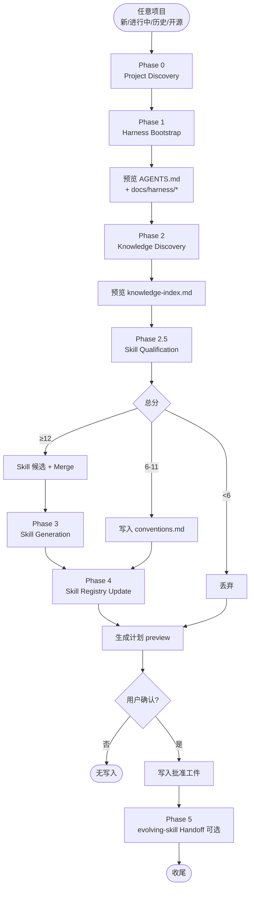
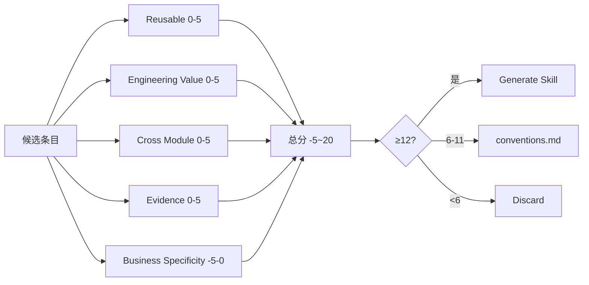
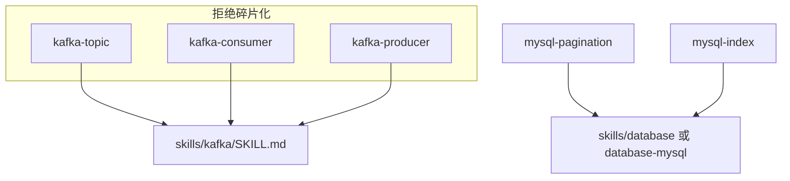
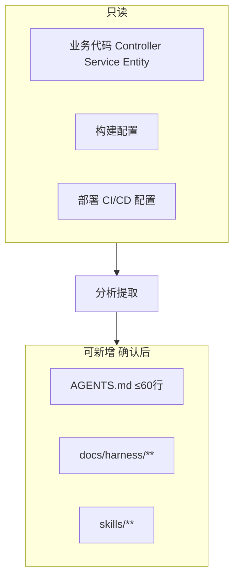
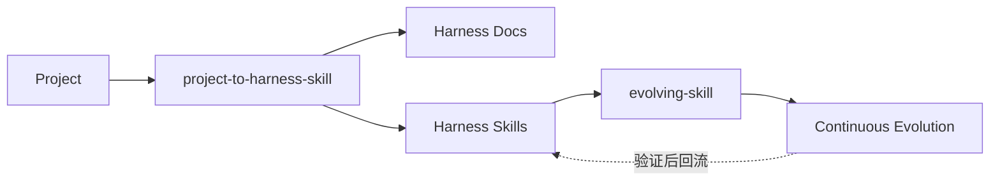

# 流程图

## 总览（Phase 0–5）

```mermaid
flowchart TD
  Start([任意项目\n新/进行中/历史/开源]) --> P0[Phase 0\nProject Discovery]
  P0 --> P1[Phase 1\nHarness Bootstrap]
  P1 --> Docs[预览 AGENTS.md\n+ docs/harness/*]
  Docs --> P2[Phase 2\nKnowledge Discovery]
  P2 --> KIdx[预览 knowledge-index.md]
  KIdx --> P25[Phase 2.5\nSkill Qualification]
  P25 --> Score{总分}
  Score -->|≥12| Cand[Skill 候选 + Merge]
  Score -->|6-11| Conv[写入 conventions.md]
  Score -->|<6| Drop[丢弃]
  Cand --> P3[Phase 3\nSkill Generation]
  P3 --> P4[Phase 4\nSkill Registry Update]
  Conv --> P4
  P4 --> Plan[生成计划 preview]
  Drop --> Plan
  Plan --> User{用户确认?}
  User -->|否| End([无写入])
  User -->|是| Write[写入批准工件]
  Write --> P5[Phase 5\nevolving-skill Handoff 可选]
  P5 --> End2([收尾])
```

## Skill Qualification

```mermaid
flowchart LR
  C[候选条目] --> R[Reusable 0-5]
  C --> E[Engineering Value 0-5]
  C --> X[Cross Module 0-5]
  C --> S[Evidence 0-5]
  C --> B[Business Specificity -5-0]
  R --> Sum[总分 -5~20]
  E --> Sum
  X --> Sum
  S --> Sum
  B --> Sum
  Sum --> G{≥12?}
  G -->|是| Gen[Generate Skill]
  G -->|6-11| Conv[conventions.md]
  G -->|<6| Disc[Discard]
```

## Skill Merge

```mermaid
flowchart TB
  subgraph frag [拒绝碎片化]
    K1[kafka-topic]
    K2[kafka-consumer]
    K3[kafka-producer]
  end
  K1 --> Merge[skills/kafka/SKILL.md]
  K2 --> Merge
  K3 --> Merge
  M1[mysql-pagination]
  M2[mysql-index]
  M1 --> DB[skills/database 或 database-mysql]
  M2 --> DB
```

## 读写边界

```mermaid
flowchart TB
  subgraph readonly [只读]
    APP[业务代码 Controller Service Entity]
    BUILD[构建配置]
    DEPLOY[部署 CI/CD 配置]
  end
  subgraph writable [可新增 确认后]
    AGENTS[AGENTS.md ≤60行]
    HARNESS[docs/harness/**]
    SKILLS[skills/**]
  end
  readonly --> Agent[分析提取]
  Agent --> writable
```

## evolving-skill 闭环

```mermaid
flowchart LR
  P[Project] --> PTH[project-to-harness-skill]
  PTH --> HD[Harness Docs]
  PTH --> HS[Harness Skills]
  HS --> ES[evolving-skill]
  ES --> CE[Continuous Evolution]
  CE -.->|验证后回流| HS
```
